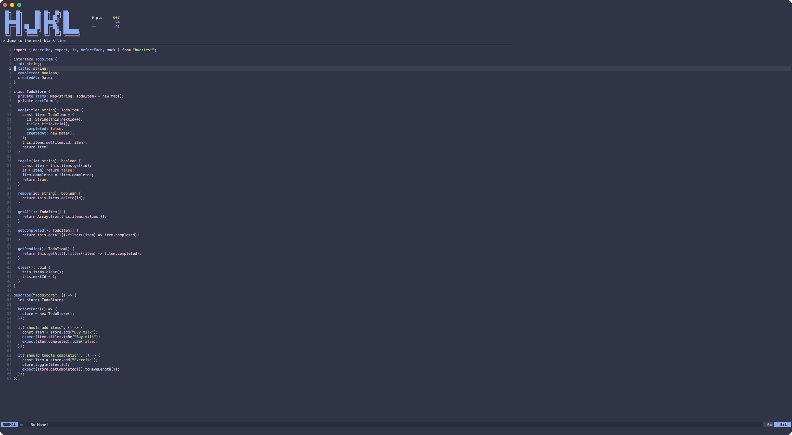

# hjkl

A terminal game that teaches Vim by making you use it.



## Philosophy

Vim fluency lives in your fingers, not your head. Reading a cheat sheet doesn't make you fast — repetition does. Real code, real edits, under time pressure. Reps until the keystrokes disappear.

## Prerequisites

- [Neovim](https://neovim.io/) (runs embedded via `nvim --embed`)
- [Bun](https://bun.sh/)
- [Task](https://taskfile.dev/)

## Install

```sh
task install
```

## Usage

```sh
hjkl
```

Endless mode (no streak pressure, just practice):

```sh
hjkl --endless
```

## Controls

- Standard Vim keys to complete each challenge

## Scoring

Complete challenges quickly for more points. Full marks under 5 seconds, with points decaying over 10 seconds. Consecutive successes build a streak multiplier up to 5x. A hint appears after 10.5 seconds of inactivity — in scored mode, that ends the game.

Top 3 scores are saved locally in `~/.hjkl/scores.db`. Reset with:

```sh
task reset
```
